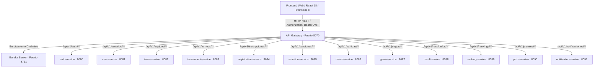

# Documento de Integración Frontend - Backend (EP3)
## eSports Arena Manager

**Arquitectura:** Microservicios Spring Boot 3.2.5 + Java 21 + Spring Cloud Gateway  
**Protocolo:** API REST con JSON y Autenticación JWT  
**Punto Único de Entrada (API Gateway):** `http://localhost:8070`  
**Descubrimiento (Eureka Dashboard):** `http://localhost:8761`  

---

## 1. Diagrama de Comunicación del Ecosistema



---

## 2. Matriz de Endpoints Consumidos por Vista

| Vista Frontend | Microservicio | Método | Ruta en Gateway (8070) | Propósito |
|---|---|---|---|---|
| **Autenticación** | `auth-service` | `POST` | `/api/v1/auth/login` | Login, emisión de JWT y rol |
| **Autenticación** | `auth-service` | `POST` | `/api/v1/auth/registro` | Registro de nuevos usuarios |
| **Listado Torneos** | `tournament-service` | `GET` | `/api/v1/torneos` | Obtención de torneos activos |
| **Listado Torneos** | `game-service` | `GET` | `/api/v1/juegos` | Listado de juegos habilitados |
| **Detalle Torneo** | `tournament-service` | `GET` | `/api/v1/torneos/{id}` | Ficha completa del torneo |
| **Detalle Torneo** | `match-service` | `GET` | `/api/v1/partidas?torneoId={id}` | Partidas y llaves de la arena |
| **Detalle Torneo** | `ranking-service` | `GET` | `/api/v1/rankings?torneoId={id}` | Tabla de posiciones oficial |
| **Detalle Torneo** | `prize-service` | `GET` | `/api/v1/premios?torneoId={id}` | Premios asignados |
| **Inscripción** | `registration-service` | `POST` | `/api/v1/inscripciones` | Registro con validación en backend |
| **Inscripción** | `sanction-service` | `GET` | `/api/v1/sanciones?usuarioId={id}` | Consulta de sanciones activas |
| **Gestión Equipos** | `team-service` | `POST` | `/api/v1/equipos` | Creación de nuevo equipo |
| **Gestión Equipos** | `team-service` | `POST` | `/api/v1/equipos/{id}/miembros` | Agregar miembro a la escuadra |
| **Perfil Jugador** | `user-service` | `GET` | `/api/v1/usuarios/{id}` | Datos de contacto y apodo |
| **Panel Organizador** | `registration-service` | `PATCH`| `/api/v1/inscripciones/{id}/estado` | Aprobar o rechazar cupos |
| **Panel Organizador** | `result-service` | `POST` | `/api/v1/resultados` | Registrar y validar marcadores |
| **Panel Organizador** | `sanction-service` | `POST` | `/api/v1/sanciones` | Aplicar sanciones con fecha fin |
| **Panel Admin** | `game-service` | `POST` | `/api/v1/juegos` | Crear nuevos juegos habilitados |
| **Panel Admin** | `tournament-service` | `POST` | `/api/v1/torneos` | Crear torneos oficiales |

---

## 3. Recorrido del Token JWT y Seguridad
1. El usuario envía sus credenciales al endpoint `/api/v1/auth/login`.
2. El `auth-service` valida credenciales contra `db_auth` y emite un token JWT firmado.
3. El frontend almacena el token en `localStorage` (`esports_token`) y los datos del perfil (`esports_user`).
4. Cada petición subsecuente a rutas protegidas inyecta la cabecera:
   ```http
   Authorization: Bearer <jwt_token>
   ```
5. El Gateway y los microservicios validan la firma y el rol (`ADMINISTRADOR`, `ORGANIZADOR`, `JUGADOR`).

---

## 4. Estrategia de Manejo de Errores HTTP

| Código HTTP | Causa | Reacción de la Interfaz |
|---|---|---|
| **400 Bad Request** | Formato de datos o validación rechazada | Muestra banner con mensaje de error legible junto al formulario. |
| **401 Unauthorized** | Token ausente, inválido o expirado | Limpia sesión en `localStorage`, notifica y redirige a la vista de login. |
| **403 Forbidden** | Rol insuficiente para la acción | Despliega pantalla de "Acceso Restringido (403)" sin exponer controles. |
| **404 Not Found** | Torneo o entidad inexistente | Muestra componente de `EstadoVacio` invitando a explorar otros torneos. |
| **500 Server Error** | Fallo interno en microservicio | Notifica fallo temporal y activa de forma transparente el fallback de datos. |
